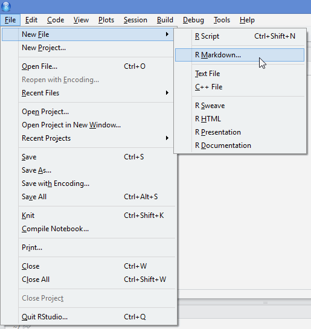
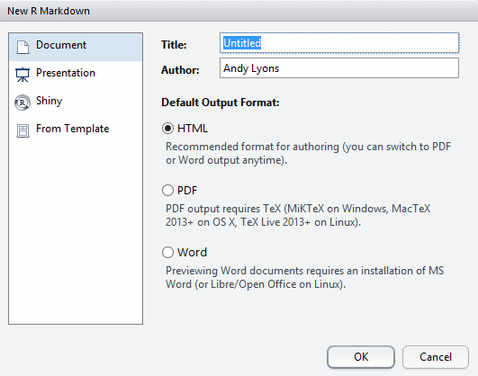
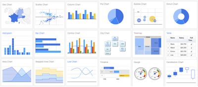
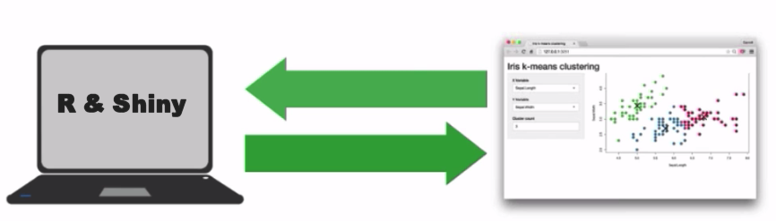
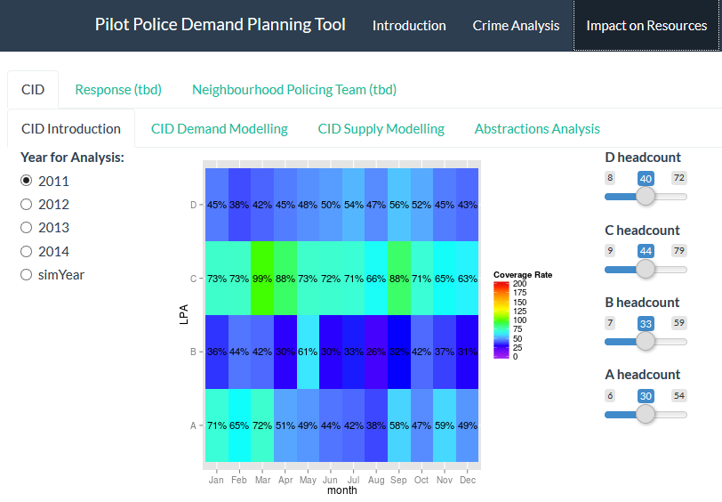
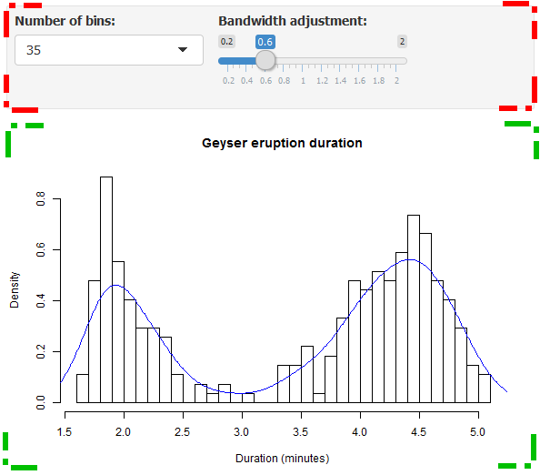

```{r loadverbatim, echo=FALSE}
## This will add a 'hook' for verbatim=TRUE
suppressPackageStartupMessages(library(knitr))
hook_source_def = knit_hooks$get('source')
knit_hooks$set(source = function(x, options){
  if (!is.null(options$verbatim) && options$verbatim){
    opts = gsub(",\\s*verbatim\\s*=\\s*TRUE\\s*", "", options$params.src)
    bef = sprintf('\n\n    ```{r %s}\n', opts, "\n")
    stringr::str_c(bef, paste(knitr:::indent_block(x, "    "), collapse = '\n'), "\n    ```\n")
  } else {
     hook_source_def(x, options)
  }
})
```

# Outline
<script type="text/javascript">w3c_slidy.mouse_click_enabled = false;</script>

* Interactivity
* Anatomy of R Markdown
* HTML Widgets
* Shiny
* Publishing

<div style="text-align:center; margin: 100px 0px;">
<u>Keyboard shortcuts for viewing slides</u><br><em>b</em>: bigger font<br><em>s</em>: smaller font<br><em>c</em>: table of contents<br><em>a</em>: show all slides at once</div>


***

<div style="text-align:center; margin: 25px 0px;">

</div>

<div style="text-align:center; margin: 25px 0px; line-height: 200%;" class="incremental">
<span>Slides: <http://www.andylyons.org/pres/idv_berkmeetup/interactive-data-viz.html></span><br>
<span>Rmd: <https://github.com/ajlyons/idv_berkmeetup></span>
</div>

# Interactivity Sampler

- <http://www.nytimes.com/interactive/2013/05/25/sunday-review/corporate-taxes.html>
- <http://www.gapminder.org/world>
- <https://plot.ly/r/>
- <https://gallery.shinyapps.io/lake_erie_fisheries_stock_assessment_app/>
- <http://shiny.snap.uaf.edu/ak_station_cru_eda/>

# Why Do We Like Interactivity?

# Spectrum of Interactivity 

<div class="colleft">

- hover / tooltip text
- animations
- manipulate symbology
- custom sorting and filtering
- set axes ranges
- pan and zoom
- download data
- change chart type
- choose which series appear on which axis
- input data and parameter values
- choose the analysis

</div>

<div class="colright" style="text-align:center;">

<span style="line-height: 200%;">
Present results  
&darr;  
&darr;  
&darr;  
&darr;  
&darr;  
&darr;  
&darr;  
&darr;  
&darr;  
Explore data
</span>
</div>

<div class="colclear"></div>


# Dynamic vs. Interactive

<div class="colleft">
<h2 style="text-decoration:underline">Dynamic</h2> 

- documents generated by R (usually from a R markdown document)
- can combine text, headings, R code and outputs (plots, tables)
- formats: PDF, HTML, Word
- gold standard for reproducible research
- may or may not be interactive

</div>

<div class="colright">
<h2 style="text-decoration:underline">Interactive</h2> 

- user can manipulate display / summary / analysis
- formats: HTML
- may or may not be dynamic

</div>

<div class="colclear"></div>


# R Markdown: Extending a Generic Document Language

- Markdown is a simple formatting syntax for authoring dynamic documents
- Simpler to write than LaTeK or HTML
- Tools to convert Markdown files to HTML, PDF, and MS Word document.
    + Usually can evaluate expressions from one or more languages (JS, Python)
- R Markdown is a flavor of Markdown that allows you to embed and run R code, include plots, 

<pre class="scrolling-code" style="height:40%">
---
title: "Analysis of the Speed and Stopping Distances of Cars"
author: "Andy Lyons"
date: "Monday, August 1, 2015"
output: html_document
---

## Trailing Distance Safety: Why the Two-Second Rule May Just Kill You

### Elements of Stopping Distance

One aspect of safe driving involves the ability to stop a car readily. This
ability depends upon the driver's alertness and readiness to stop, the
conditions of the road, the speed of the car, and the braking characteristics of
the car. The actual distance that it takes to stop the car can be thought of as
consisting of two parts: the reaction distance and braking distance. 

When a driver sees an event in his/her field of view that might warrant braking
(for example, a dog running into the street), a collection of actions must be
taken before the braking actually begins. First the driver must identify the
event and decide if braking is necessary. Then the driver must lift his/her foot
off the gas pedal and move it to the brake pedal. And finally, the driver must
press the brake down its full distance in order to obtain maximum braking
acceleration. The time to do all this is known as the reaction time. The
distance traveled during this time is known as the __reaction distance__. Once
the brakes are applied, the car begins to slow to a stop. The distance traveled
by the car during this time is known as the __braking distance__. The braking
distance is dependent upon the original speed of the car, the road conditions,
and characteristics of the car such as its profile area, mass and tire
conditions. 

&#96;``{r}
library(ggplot2)
stop_dist <- read.csv("stopping_dist_cars.csv", stringsAsFactors=FALSE, strip.white=TRUE)
stop_dist <- transform(stop_dist, total_dist=breaking_dist + reaction_dist) 
ggplot(data=stop_dist, aes(x=speed, y=total_dist, group=surface, colour=surface)) + 
geom_line() + geom_point() + ggtitle("Total Stopping Distance by Speed") + 
xlab("Speed (km/h)") + ylab("Total stopping distance (m)")
&#96;``

### Vehicle Performance and Stopping Distance

The data give the speed of cars and the distances taken to stop. Note that 
the data were recorded in the 1920s.

&#96;``{r}
plot(cars)
&#96;``

Source: Ezekiel, M. (1930) Methods of Correlation Analysis. Wiley.

</pre>

# R Markdown: Flavors {.incremetal}
    
- All varieties of R Markdown support the majority of R Markdown syntax
    + formatting
    + styles
    + code chunks
- Different 'flavors' of R Markdown provide additional functionality and customization
- Each flavor generally designed for a specific type of output
    + documents
    + presentation (RPresentations, ioslides, slidy, slidify, beamer)
    + app (Shiny)

# R Markdown: Merely A Means to an End

<div style="margin-top:80px; text-align:center;">
\*.Rmd &#8594; <span class="pkgname">knitr</span> &#8594; \*.md &#8594; <span class="pkgname">pandoc</span> &#8594; <span style="display:inline-block; margin-left:0.6em; vertical-align:middle; text-align:left;">\*.pdf (requires TeK also)<br><br>\*.doc<br><br>\*.html (+ \*.css, \*.js \*.ttf)</span>
</div>                                                

# R Markdown: Support in RStudio






For more details see <http://rmarkdown.rstudio.com>.

# R Markdown: Anatomy of a Document

<div class="colleft" style="width:20%;">

YAML section

Paragraph text

Code chunks

</div>

<div class="colright" style="width:75%; height:20%;">
<pre class="scrolling-code" style="height:450px;">
---
title: "Untitled"
author: "Andy Lyons"
date: "Monday, August 17, 2015"
output: html_document
---

This is an R Markdown document. Markdown is a simple formatting syntax for
authoring HTML, PDF, and MS Word documents. For more details on using R Markdown
see <http://rmarkdown.rstudio.com>

When you click the **Knit** button a document will be generated that includes
both content as well as the output of any embedded R code chunks within the
document. You can embed an R code chunk like this:

&#96;``{r}
summary(cars)
&#96;``

You can also embed plots, for example:

&#96;``{r, echo=FALSE}
plot(cars)
&#96;``

Note that the `echo = FALSE` parameter was added to the code chunk to prevent
printing of the R code that generated the plot.
</pre>
</div>

<div class="colclear"></div>

# R Markdown: YAML

<div class="incremental">
<div>
Standard stuff

<pre class="markdown">
---
title: "Interactive Data Visualization"
author: "Andy Lyons"
date: "Friday, August 18, 2015"
output: slidy_presentation
---
</pre>
</div>

<div>
Other Common Options

<pre class="markdown">
output:
  html_document:
    fig_height: 4
    fig_width: 4
    smart: no
    theme: journal
    <strong>self_contained: no</strong>
</pre>
</div>

<div>
Easy Way to Change Common YAML Options


</div>

<div>
Flavor Specific Options

<pre class="markdown">
---
output:
  slidy_presentation:
    incremental: true
    highlight: pygments
    font_adjustment: -1
    duration: 45
    mathjax: local
    footer: "Berkeley R Language Beginner Study Group, Aug. 18, 2015"
    includes:
      in_header: idv_header.html    
---
</pre>
</div>

</div>

# R Markdown: Paragraph Text

Formatting paragraph text is easy. See the 'Markdown Quick Reference' to get started. Start a new paragraphs with a blank line.

### Emphasis

```
*italic*   **bold**
_italic_   __bold__
```

### Headers

```
# Header 1
## Header 2
### Header 3
```

### Lists

Unordered List

```
* Item 1
* Item 2
    + Item 2a
    + Item 2b
```

Ordered List

```
1. Item 1
2. Item 2
3. Item 3
    + Item 3a
    + Item 3b
```

### Manual Line Breaks

End a line with two or more spaces:

```
Roses are red,   
Violets are blue.
```

### Links

Use a plain http address or add a link to a phrase:

```
http://example.com

[linked phrase](http://example.com)
```

### Images

Images on the web or local files in the same directory:

```


```

### Blockquotes

A friend once said:
```
> It's always better to give 
> than to receive.
```

For more info, see <http://rmarkdown.rstudio.com/>

# R Markdown: Code Chunks

<div class="colleft" style="width:55%;">

<pre class="markdown">
&#96;``{r}
x <- rnorm(30) * 1000
plot(x, type="b", pch=20, main="China
     Stock Market")
&#96;``
</pre>
</div>

<div class="colright" style="width:45%;">
```{r plotchinastockmarket}
x <- rnorm(30) * 1000
plot(x, type="b", pch=20, main="China 
     Stock Market")
```
</div>

<div class="colclear"></div>

### Code Chunk Options

<div class="colleft" style="width:55%;">

<pre class="markdown">
&#96;``{r, <strong>echo=FALSE</strong>}
x <- rnorm(30) * 1000
plot(x, type="b", pch=20, main="China
     Stock Market")
&#96;``
</pre>

Many other code chunk options to do things like:

- hide messages, warnings, output
- change figure dimensions, alignment
- modify appearance of console output
- etc.

</div>

<div class="colright" style="width:45%;">
```{r chinastock2, echo=FALSE}
x <- rnorm(30) * 1000
plot(x, type="b", pch=20, main="China 
     Stock Market")
```
</div>

<div class="colclear"></div>


### Code Chunk Environment

- All code in a R Markdown document is executed in a separate environment
- This means all libraries and data objects have to be loaded in the R Markdown document (i.e., in a code chunk)
    + The packages and objects loaded in your base environment won't do you any good :-(
- Method behind the madness: reproducible research
- Example:


<pre class="markdown">
&#96;``{r}
ggplot(data=brake_dist, aes(x=speed, y=total_dist, group=surface, colour=surface)) +
geom_line() + geom_point()

## This will NOT work. Even if 'brake_dist' exists in our base environment,
## we haven't loaded it in this R Markdown document.
&#96;``
</pre>

- This one  will work, because we load ggplot2 and the data before we use them:

<pre class="markdown">
&#96;``{r, fig.height=4, fig.width=7, echo=FALSE}
library(ggplot2)
brake_dist <- read.csv("stopping_dist_cars.csv", stringsAsFactors=FALSE, strip.white=TRUE)
ggplot(data=brake_dist, aes(x=speed, y=total_dist, group=surface, colour=surface)) +
geom_line() + geom_point()
&#96;``
</pre>

```{r ggplotcars2, fig.height=4, fig.width=7, echo=FALSE}
library(ggplot2)
stop_dist <- read.csv("stopping_dist_cars.csv", stringsAsFactors=FALSE, strip.white=TRUE)
ggplot(data=stop_dist, aes(x=speed, y=total_dist, group=surface, colour=surface)) +
geom_line() + geom_point()
```

### R Markdown Resources

- Cheatsheet: <https://www.rstudio.com/wp-content/uploads/2015/02/rmarkdown-cheatsheet.pdf>
- Reference Guide: <https://www.rstudio.com/wp-content/uploads/2015/03/rmarkdown-reference.pdf>


# Interactivity

<div class="colleft">

### Client-side Interactivity

- animation
- HTML widgets

### <br>Hybrid

- googleVis - both browser and (local) server (?)

</div>

<div class="colright">

### Server-side Interactivity

- Shiny Apps

</div>

<div class="colclear"></div>


# Animation

- You can turn a series of plots produced by a code chunk into an animation
- Add the __fig.show='animate'__ code chunk option
- This requires the free utility _ffmpeg_ be installed (cross-platform)
    + also a SWF option
- Animation comes as embedded video (only visible in a browser)
- Recommend: self_contained: no

### Example

```
``'{r animate_test, fig.show='animate', fig.width=4, fig.height=4, interval=0.05, aniopts="controls,loop"}
for (i in 1:50) {
    plot(x=i/10, y=i/10, xlim=c(0,6), ylim=c(0,6), pch=20, col=palette()[2], cex=5)
}
'``
```

```{r animate_test, echo=FALSE, cache=TRUE, fig.align='center', fig.show='animate', fig.width=4, fig.height=4, interval=0.05, aniopts="controls,loop"}
for (i in 1:50) {
    plot(x=i/10, y=i/10, xlim=c(0,6), ylim=c(0,6), pch=20, col=palette()[2], cex=5)
}
```


# HTML Widgets

- Widgets are combos of HTML5, JavaScript, CSS, and D3 to provide interactivity
- client-side processing - everything resides in the browser!
- R packages provide familiar R functions to generate the HTML code, libraries:
    + these packages use functions and classes from the <span class="pkgname">htmlwidgets</span>
    + some packages are on github, require <span class="pkgname">devtools</span> to install
- More info and widget gallery at <http://www.htmlwidgets.org/>

# HTML Widget: DT 

<span class="pkgname">DT</span> package creates interactive HTML tables that support filtering, pagination, and sorting.


```{r}
library(DT)
datatable(iris, options = list(pageLength = 10))
```

Under the hood:

<pre class="scrolling-code" style="height:25%;">
&lt;h1>HTML Widgets: DT Demo&lt;/h1> &lt;p>&lt;span class="pkgname">DT&lt;/span> package creates
interactive HTML tables that support filtering, pagination, and sorting.&lt;/p> &lt;pre
class="sourceCode r">&lt;code class="sourceCode r">&lt;span
class="kw">library&lt;/span>(DT)&lt;/code>&lt;/pre> &lt;pre>&lt;code>## Warning: package
&#39;DT&#39; was built under R version 3.2.2&lt;/code>&lt;/pre> &lt;pre class="sourceCode
r">&lt;code class="sourceCode r">&lt;span class="kw">datatable&lt;/span>(iris, &lt;span
class="dt">options =&lt;/span> &lt;span class="kw">list&lt;/span>(&lt;span class="dt">pageLength
=&lt;/span> &lt;span class="dv">5&lt;/span>))&lt;/code>&lt;/pre> &lt;p>&lt;div id="htmlwidget-3068"
style="width:100%;height:auto;" class="datatables">&lt;/div> &lt;script type="application/json"
data-for="htmlwidget-
3068">{"x":{"data":[["1","2","3","4","5","6","7","8","9","10","11","12","13","14","15","16","17"
,"18","19","20","21","22","23","24","25","26","27","28","29","30","31","32","33","34","35","36"
,"37","38","39","40","41","42","43","44","45","46","47","48","49","50","51","52","53","54","55"
,"56","57","58","59","60","61","62","63","64","65","66","67","68","69","70","71","72","73","74"
,"75","76","77","78","79","80","81","82","83","84","85","86","87","88","89","90","91","92","93"
,"94","95","96","97","98","99","100","101","102","103","104","105","106","107","108","109","110"
,"111","112","113","114","115","116","117","118","119","120","121","122","123","124","125","126"
,"127","128","129","130","131","132","133","134","135","136","137","138","139","140","141","142"
,"143","144","145","146","147","148","149","150"],[5.1,4.9,4.7,4.6,5,5.4,4.6,5,4.4,4.9,5.4,4.8,4.8
,4.3,5.8,5.7,5.4,5.1,5.7,5.1,5.4,5.1,4.6,5.1,4.8,5,5,5.2,5.2,4.7,4.8,5.4,5.2,5.5,4.9,5,5.5,4.9,4.4
,5.1,5,4.5,4.4,5,5.1,4.8,5.1,4.6,5.3,5,7,6.4,6.9,5.5,6.5,5.7,6.3,4.9,6.6,5.2,5,5.9,6,6.1,5.6,6.7,5
.6,5.8,6.2,5.6,5.9,6.1,6.3,6.1,6.4,6.6,6.8,6.7,6,5.7,5.5,5.5,5.8,6,5.4,6,6.7,6.3,5.6,5.5,5.5,6.1,5
.8,5,5.6,5.7,5.7,6.2,5.1,5.7,6.3,5.8,7.1,6.3,6.5,7.6,4.9,7.3,6.7,7.2,6.5,6.4,6.8,5.7,5.8,6.4,6.5,7
.7,7.7,6,6.9,5.6,7.7,6.3,6.7,7.2,6.2,6.1,6.4,7.2,7.4,7.9,6.4,6.3,6.1,7.7,6.3,6.4,6,6.9,6.7,6.9,5.8
,6.8,6.7,6.7,6.3,6.5,6.2,5.9],[3.5,3,3.2,3.1,3.6,3.9,3.4,3.4,2.9,3.1,3.7,3.4,3,3,4,4.4,3.9,3.5,3.8
,3.8,3.4,3.7,3.6,3.3,3.4,3,3.4,3.5,3.4,3.2,3.1,3.4,4.1,4.2,3.1,3.2,3.5,3.6,3,3.4,3.5,2.3,3.2,3.5,3
.8,3,3.8,3.2,3.7,3.3,3.2,3.2,3.1,2.3,2.8,2.8,3.3,2.4,2.9,2.7,2,3,2.2,2.9,2.9,3.1,3,2.7,2.2,2.5,3.2
,2.8,2.5,2.8,2.9,3,2.8,3,2.9,2.6,2.4,2.4,2.7,2.7,3,3.4,3.1,2.3,3,2.5,2.6,3,2.6,2.3,2.7,3,2.9,2.9,2
.5,2.8,3.3,2.7,3,2.9,3,3,2.5,2.9,2.5,3.6,3.2,2.7,3,2.5,2.8,3.2,3,3.8,2.6,2.2,3.2,2.8,2.8,2.7,3.3,3
.2,2.8,3,2.8,3,2.8,3.8,2.8,2.8,2.6,3,3.4,3.1,3,3.1,3.1,3.1,2.7,3.2,3.3,3,2.5,3,3.4,3],[1.4,1.4,1.3
,1.5,1.4,1.7,1.4,1.5,1.4,1.5,1.5,1.6,1.4,1.1,1.2,1.5,1.3,1.4,1.7,1.5,1.7,1.5,1,1.7,1.9,1.6,1.6,1.5
,1.4,1.6,1.6,1.5,1.5,1.4,1.5,1.2,1.3,1.4,1.3,1.5,1.3,1.3,1.3,1.6,1.9,1.4,1.6,1.4,1.5,1.4,4.7,4.5,4
.9,4,4.6,4.5,4.7,3.3,4.6,3.9,3.5,4.2,4,4.7,3.6,4.4,4.5,4.1,4.5,3.9,4.8,4,4.9,4.7,4.3,4.4,4.8,5,4.5
,3.5,3.8,3.7,3.9,5.1,4.5,4.5,4.7,4.4,4.1,4,4.4,4.6,4,3.3,4.2,4.2,4.2,4.3,3,4.1,6,5.1,5.9,5.6,5.8,6
.6,4.5,6.3,5.8,6.1,5.1,5.3,5.5,5,5.1,5.3,5.5,6.7,6.9,5,5.7,4.9,6.7,4.9,5.7,6,4.8,4.9,5.6,5.8,6.1,6
.4,5.6,5.1,5.6,6.1,5.6,5.5,4.8,5.4,5.6,5.1,5.1,5.9,5.7,5.2,5,5.2,5.4,5.1],[0.2,0.2,0.2,0.2,0.2,0.4
,0.3,0.2,0.2,0.1,0.2,0.2,0.1,0.1,0.2,0.4,0.4,0.3,0.3,0.3,0.2,0.4,0.2,0.5,0.2,0.2,0.4,0.2,0.2,0.2,0
.2,0.4,0.1,0.2,0.2,0.2,0.2,0.1,0.2,0.2,0.3,0.3,0.2,0.6,0.4,0.3,0.2,0.2,0.2,0.2,1.4,1.5,1.5,1.3,1.5
,1.3,1.6,1,1.3,1.4,1,1.5,1,1.4,1.3,1.4,1.5,1,1.5,1.1,1.8,1.3,1.5,1.2,1.3,1.4,1.4,1.7,1.5,1,1.1,1,1
.2,1.6,1.5,1.6,1.5,1.3,1.3,1.3,1.2,1.4,1.2,1,1.3,1.2,1.3,1.3,1.1,1.3,2.5,1.9,2.1,1.8,2.2,2.1,1.7,1
.8,1.8,2.5,2,1.9,2.1,2,2.4,2.3,1.8,2.2,2.3,1.5,2.3,2,2,1.8,2.1,1.8,1.8,1.8,2.1,1.6,1.9,2,2.2,1.5,1
.4,2.3,2.4,1.8,1.8,2.1,2.4,2.3,1.9,2.3,2.5,2.3,1.9,2,2.3,1.8],["setosa","setosa","setosa","setosa"
,"setosa","setosa","setosa","setosa","setosa","setosa","setosa","setosa","setosa","setosa","setosa"
,"setosa","setosa","setosa","setosa","setosa","setosa","setosa","setosa","setosa","setosa","setosa"
,"setosa","setosa","setosa","setosa","setosa","setosa","setosa","setosa","setosa","setosa","setosa"
,"setosa","setosa","setosa","setosa","setosa","setosa","setosa","setosa","setosa","setosa","setosa"
,"setosa","setosa","versicolor","versicolor","versicolor","versicolor","versicolor","versicolor"
,"versicolor","versicolor","versicolor","versicolor","versicolor","versicolor","versicolor"
,"versicolor","versicolor","versicolor","versicolor","versicolor","versicolor","versicolor"
,"versicolor","versicolor","versicolor","versicolor","versicolor","versicolor","versicolor"
,"versicolor","versicolor","versicolor","versicolor","versicolor","versicolor","versicolor"
,"versicolor","versicolor","versicolor","versicolor","versicolor","versicolor","versicolor"
,"versicolor","versicolor","versicolor","versicolor","versicolor","versicolor","versicolor"
,"versicolor","versicolor","virginica","virginica","virginica","virginica","virginica","virginica"
,"virginica","virginica","virginica","virginica","virginica","virginica","virginica","virginica"
,"virginica","virginica","virginica","virginica","virginica","virginica","virginica","virginica"
,"virginica","virginica","virginica","virginica","virginica","virginica","virginica","virginica"
,"virginica","virginica","virginica","virginica","virginica","virginica","virginica","virginica"
,"virginica","virginica","virginica","virginica","virginica","virginica","virginica","virginica"
,"virginica","virginica","virginica","virginica"]],"container":"&lt;table class=\"display\">\n
&lt;thead>\n    &lt;tr>\n      &lt;th> &lt;/th>\n      &lt;th>Sepal.Length&lt;/th>\n
&lt;th>Sepal.Width&lt;/th>\n      &lt;th>Petal.Length&lt;/th>\n      &lt;th>Petal.Width&lt;/th>\n   
&lt;th>Species&lt;/th>\n    &lt;/tr>\n
&lt;/thead>\n&lt;/table>","options":{"pageLength":5,"columnDefs":[{"className":"dt-
right","targets":[1,2,3,4]},{"orderable":false,"targets":0}],"order":[],"autoWidth":false
,"orderClasses":false,"lengthMenu":[5,10,25,50,100]},"callback":null,"filter":"none"},"evals":[]
}&lt;/script>&lt;/p>
</pre>

Other options:

- formatting for columns, select columns, hide/show additional columns, freeze columns, save table as CSV/Excel

- More info see <http://rstudio.github.io/DT/extensions.html>


# HTML Widget: Dygraphs

<span class="pkgname">dygraphs</span> provides rich facilities for charting time-series data in R and includes support for many interactive features including series/point highlighting, zooming, and panning.package creates interactive HTML tables that support filtering, pagination, and sorting.

```{r, fig.width=7}
library(dygraphs)
lungDeaths <- cbind(mdeaths, fdeaths)
dygraph(lungDeaths) %>%
  dySeries("mdeaths", label = "Male") %>%
  dySeries("fdeaths", label = "Female") %>%
  dyOptions(stackedGraph = TRUE) %>%
  dyRangeSelector(height = 20)
```

More info: <http://rstudio.github.io/dygraphs>

# HTML Widget: Leaflet 

### <a href="leaflet_demo.html" target="_top">leaflet_demo.html</a>

# googleVis

<span class="pkgname">googleVis</span> is a R interface to Google Charts API

<div style="text-align:center;"></div>

- Many many chart types
- The data remains local and is not uploaded to Google.
- Charts are displayed locally via the R HTTP help server.
- Flash alert! A modern browser with Internet connection is required and for some Flash charts. 


### First - Code Chunk to Set Options

The first thing we do is to create a code chunk that sets the googleVis options first to change the behaviour of plot.gvis, so that only the chart component of the HTML file is spit out. You normally would hide a code chunk like this by setting _echo=FALSE_ and _results='hide'_.

```{r setOptions, message=FALSE, verbatim=TRUE}
suppressPackageStartupMessages(library(googleVis))
op <- options(gvis.plot.tag='chart')
```

Now we're ready to use it. Note the use of code chunk option _results='asis'_ is required.

### Pie Example

```{r gvisPieExample, results='asis', verbatim=TRUE}
Pie <- gvisPieChart(CityPopularity, options = list(width=400, height=400))
plot(Pie)
```

### Supercharged Scatter Plot 

To illustrate that linearity is often a matter of scale, drag and pan with a left mouse button to zoom in. Right-click to zoom out again. 

```{r gvisScatterOneExample, results='asis', verbatim=TRUE}
## Source: http://statistics.rainandrhino.org/blog/2014/09/03/google-charts/
set.seed(2020)
x <- seq(0,100,by=0.5)
y <- (50-x)^2+rnorm(length(x),sd=100)
curvy <- data.frame(x,y)
gvScat <- gvisScatterChart(curvy,
                   options=list(
                     explorer="{actions: ['dragToZoom',
                     'rightClickToReset'],
                     maxZoomIn:0.05}",
                     chartArea="{width:'85%',height:'80%'}",
                     hAxis="{title: 'Explanatory x',
                     titleTextStyle: {color: '#000000'}}",
                     vAxis="{title: 'Response y',
                     titleTextStyle: {color: '#000000'}}",
                     title="Curvilinear Relationship",
                     width=550, height=500,
                     legend="none"),
                     chartid="ZoomZoom")
plot(gvScat)
```


## Motion Chart

```{r MotionChartExample, results='asis', tidy=FALSE}
M <- gvisMotionChart(Fruits, 'Fruit', 'Year', options=list(width=400, height=350))
plot(M)
```

> Note that the Motion Chart is only displayed when hosted on a web server, or if placed in a
> directory which has been added to the trusted sources in the [security settings of Macromedia](http://www.macromedia.com/support/documentation/en/flashplayer/help/settings_manager04.html). 
> You should also set self_contained to no in the R Markdown YAML. See the googleVis package vignette for
> more details. 

Finally, restore the googleVis options back to what they were.

```{r resetOptions, verbatim=TRUE}
## Set options back to original options
options(op)
```

### More Examples

- <https://cran.r-project.org/web/packages/googleVis/vignettes/googleVis_examples.html>


# Shiny

Server side technology



- don't have to send all the data to the browser
- can customize computation
- access to many more R resources


# Starting a New Shiny Document


Default YAML created:

```
---
title: "Untitled"
author: "Andy Lyons"
date: "Tuesday, August 18, 2015"
output: html_document
runtime: shiny
---
```

Rather limited layout options:


# Shiny apps

- very flexible GUI (especially with HTML/CSS)
- more control of reactivity (computationally intensive processes)




# Anatomy of a Shiny document

<div class="colleft" style="width:29%;">

<span style="color:red;">UI</span> functions display input elements and output elements

<span style="color:green;">Render</span> functions create placeholders where output will go, and grab the current value of the input elements

</div>

<div class="colright" style="width:70%;">

</div>

<div class="colclear"></div>


### Example

Let's say we want to make this plotting function interactive:

```
hist(faithful$eruptions, probability=TRUE, breaks=20,
       xlab = "Duration (minutes)", main = "Geyser eruption duration")
dens <- density(faithful$eruptions, adjust=1)
lines(dens, col = "blue")       
```    

### Input elements

- display inputs with _selectInput(), sliderInput(), textInput(), numericInput()_, etc.
    + first argument becomes the 'name' you can use elsewhere in code
- enclose selectXXX() functions as the 'arguments' to _inputPanel()_
    + inputPanel() can go at the top or bottom of code chunk

```
inputPanel(
  selectInput("n_breaks", label = "Number of bins:",
              choices = c(10, 20, 35, 50), selected = 20),
  
  sliderInput("bw_adjust", label = "Bandwidth adjustment:",
              min = 0.2, max = 2, value = 1, step = 0.2)
)
```

### Render elements

- designate where plots should appear with _renderPlot(), renderTable()_, etc.
- grab value of input elements using _input$element_name_

```
renderPlot({
  hist(faithful$eruptions, probability = TRUE, breaks = as.numeric(input$n_breaks),
       xlab = "Duration (minutes)", main = "Geyser eruption duration")
  dens <- density(faithful$eruptions, adjust = input$bw_adjust)
  lines(dens, col = "blue")
})
```

### Whole code chunk

```
inputPanel(
  selectInput("n_breaks", label = "Number of bins:",
              choices = c(10, 20, 35, 50), selected = 20),
  
  sliderInput("bw_adjust", label = "Bandwidth adjustment:",
              min = 0.2, max = 2, value = 1, step = 0.2)
)

renderPlot({
  hist(faithful$eruptions, probability = TRUE, breaks = as.numeric(input$n_breaks),
       xlab = "Duration (minutes)", main = "Geyser eruption duration")
  dens <- density(faithful$eruptions, adjust = input$bw_adjust)
  lines(dens, col = "blue")
})
```

# Shiny Resources

- <http://rmarkdown.rstudio.com/authoring_shiny.html>
- <https://www.rstudio.com/resources/webinars/>

# Other R Integrated Tools

RCharts

- similar functionality to googleVis
- uses a formula syntax similar to the lattice package
- get started at <http://rcharts.io/> and <http://timelyportfolio.github.io/docs/_build/html/quickstart/index.html>

Plotly

- <scan class="pkgname">plotly</scan> takes as input a ggplot2 object and transforms it into an interactive chart that can then be embedded into websites. Using the service requires authentication, which is a clear limitation. By default all plots are made publicly visible to anyone, but there apparently is a way to produce private plots as well, with a limit in their number in the free account. 
- see <https://ropensci.org/blog/2014/04/17/plotly/>

Manipulate

- The <scan class="pkgname">maniuplate</scan> package provides a pallete of sliders and pickers for use within RStudio

# Sharing Your Work

### General Public

HTML reports

- any standard server (be sure to include the js & css files)
- RPubs (free service, integrated with RStudio)

Shiny documents and apps

- shiny.io 
    + free account allows 5 public apps
    + see <span class="pkgname">shinyapps</span> package to streamline uploading
- install shiny server on your own network

### R Users

- share scripts and Rmd files
- bundle in a package

# Summary

Think about _why_ you want to make data visualizations interactive

Many options using R Markdown

Heavy duty interactivity possible with Shiny


